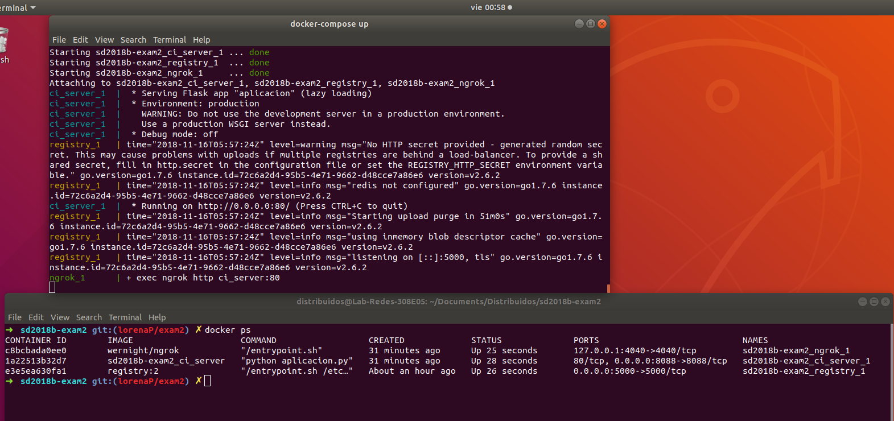
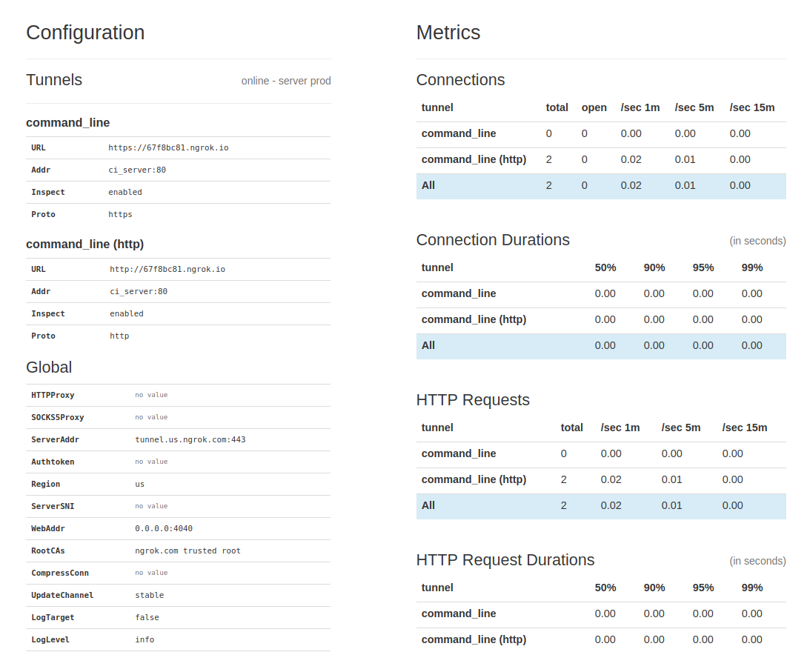

# sd2018b-exam2

**Universidad Icesi**  
**Curso:** Sistemas Distribuidos   
**Profesor:** Daniel Barragán.  
**Tema:** Construcción de artefactos para entrega continua (Continous Delivery)  
**Estudiante:** Angie Lorena Peŕez 
**Codigo:** A00242068  
**Git URL:** https://github.com/AlorenaP/sd2018b-exam2.git

## Objetivos
* Realizar de forma autómatica la generación de artefactos para entrega continua
* Emplear librerías de lenguajes de programación para la realización de tareas específicas
* Diagnosticar y ejecutar de forma autónoma las acciones necesarias para corregir fallos en
la infraestructura

## Descripción

En este repositorio se aloja todos los componentes para la construcción de un artefacto tipo Docker a partir de las fuentes de su microservicio.
Los contenedores y demas recursos ques se emplean aqui para tal proposito son:

Un registry local de Docker para el almacenamiento de imágenes de Docker.

Método en Python3.6 o superior que reciba como entrada el nombre de un servicio, la version y el tipo (Docker ó AMI) que en su lógica hace la construcción de una imagen de Docker y posteriormente sera publicada en el Registry local.

Se crea un webhook de github que enviará una carga al **ci_service** que validará si la petición pull realizada ha sido fusionada correctamente, es decir, alojandose en el Registry

### Deployment


**docker-compose.yml** 

En este archivo se especifican para cada CT el aprovisionamiento correspondiente. Primero el ci_server que contiene el script Dockerfile y python para crear la imagen de CI Server Docker. Segundo registry, este servicio local almacena las imagenes de Docker que se estan creando en el merged de la rama develop. Tercero ngrok, crea el canal donde se podra postear el ci_server.


```
version: "2"
services:
  ci_server:
    build: ./ci_server
    ports:
     - "8088:8088"
    volumes:
     - //var/run/docker.sock:/var/run/docker.sock
  registry:
    restart: always
    image: registry:2
    ports:
      - 5000:5000
    environment:
      REGISTRY_HTTP_ADDR: 0.0.0.0:5000
      REGISTRY_HTTP_TLS_CERTIFICATE: ./certs/domain.crt
      REGISTRY_HTTP_TLS_KEY: ./certs/domain.key
    volumes:
      - ./certs:/certs
      - ./data:/data
  ngrok:
    image: wernight/ngrok
    ports:
      - 127.0.0.1:4040:4040
    links:
      - ci_server
    environment:
      NGROK_PORT: ci_server:80
```

Acontinuacion se evidencia la creacion de los servicios.



Seguidamente se puede haceder al servicio prestado por **ngrok** y ver el estado.




**ci_server**

En este servicio se aloja el archivo Dockerfile y aplicacion.py. En el DockerFile se hace el llamado a instalar los paquetes necesarios que provee requirements.txt para configurar el ambiente.

```
FROM python:3.6-slim

WORKDIR /aplicacion

COPY . /aplicacion

RUN pip install -r requirements.txt

EXPOSE 80

ENV NAME World

# Run aplicacion.py
CMD ["python", "aplicacion.py"]
```

En **aplicacion.py** se dan las instrucciones de los artefactos a desarrollar de este repositorio. El método en python recibe como entrada el nombre del servicio, y en su lógica hace la construcción de una imagen de Docker que posteriormente sera publicada en el Registry local.


```
from flask import Flask, request, json
import requests
import docker
import os
import socket

app = Flask(__name__)

@app.route("/")
def hello():
    return "Hello"
    
@app.route("/AlorenaP/exam2/api/v1/images", methods=['POST'])
def image_merge():
*
*
*
*
```

Con los servicios arriba corriendo, en Github creamos un **webhook**, aqui ponemos la URL que proporciona ngrok.


El paso siguiente es producir un cambio en la rama lorenaP/merge, para poder hacer un pull request que se pase por el webhook, y si no se presenta ningun problema, se debe hacer merge a la rama develop.


